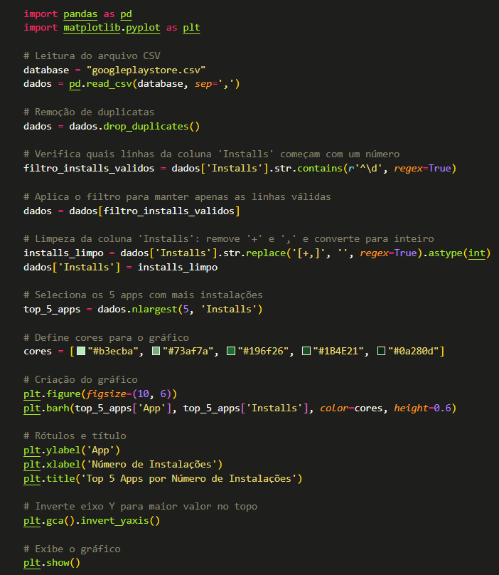
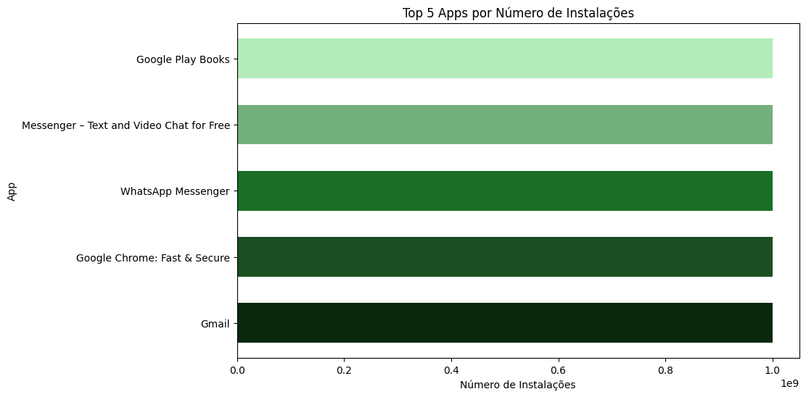
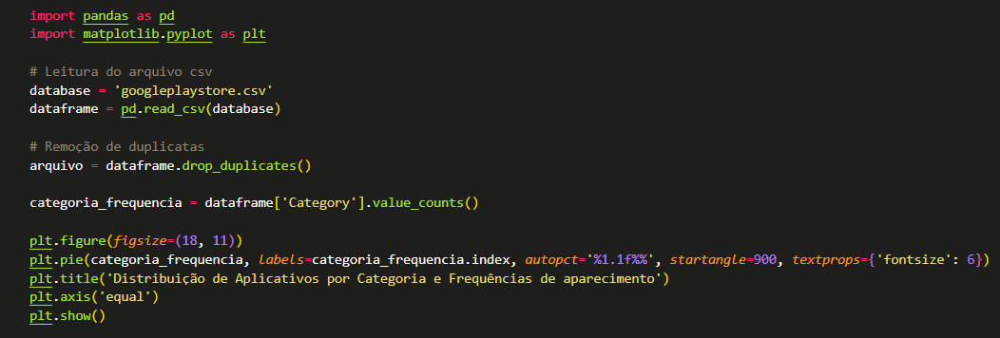
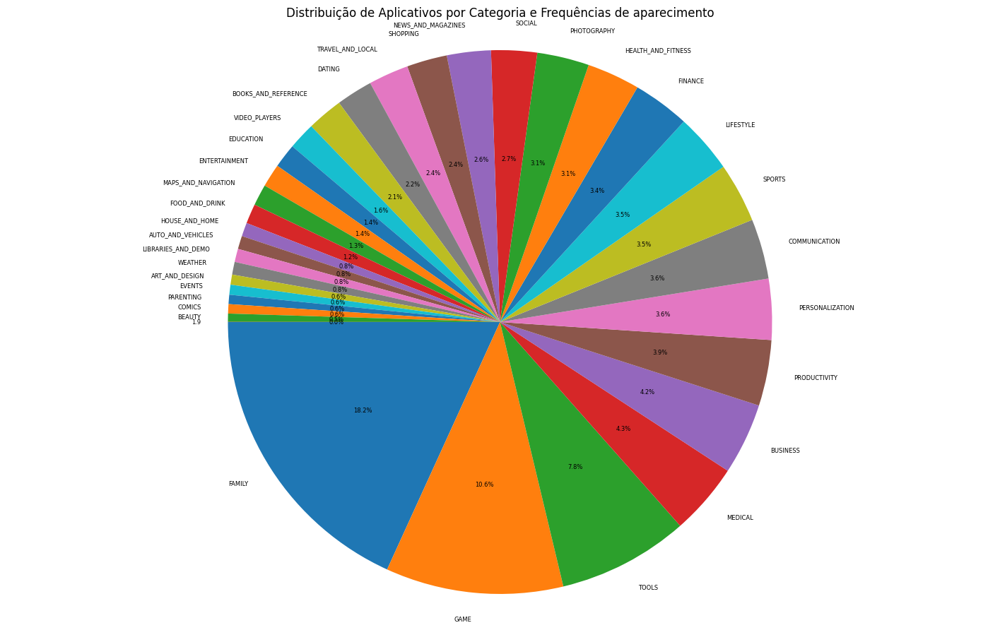
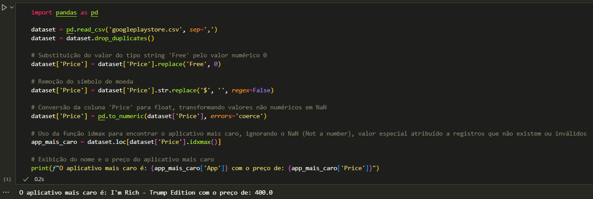

# Desafio Python - Análise de Aplicativos da Playstore

O projeto desenvolvido é focado em aplicar técnicas de análise e visualização de dados usando Python. O dataset utilizado, googleplaystore.csv, está disponibilizado na plataforma Kaggle e contém informações detalhadas sobre diversos aplicativos disponíveis na Google Play Store, incluindo número de instalações, categorias, classificações etárias, preços, e entre outros dados relevantes. O objetivo principal do projeto foi explorar e analisar o dataset para extrair insights valiosos, identificando tendências e padrões presentes nos dados, e apresentar esses resultados de forma visual com o auxílio de diferentes tipos gráficos. Para isso, foram utilizadas as bibliotecas Pandas, para manipulação e tratamento de dados, e Matplotlib, para construção de gráficos. Todas as atividades foram executadas com a extensão Jupyter no VS Code.
O desenvolvimento do projeto seguiu 8 (oito) etapas principais, descritas a seguir:

- Preparação dos Dados: Leitura do arquivo googleplaystore.csv e remoção de registros duplicados, visando assegurar a qualidade e a confiabilidade dos dados analisados, evitando a duplicação de dados.

- Identificação dos 5 (cinco) Principais Aplicativos por Número de Instalações: Seleção dos cinco aplicativos mais populares em termos de instalações e visualização por meio de um gráfico de barras.

- Análise das categorias de aplicativos por frequência de aparecimento: Categorização dos aplicativos com base na frequência de aparecimento, gerando um gráfico de pizza que representa a frequência de cada categoria dentro do dataset.

- Determinação do Aplicativo Mais Caro: Identificação do app de maior valor presente no conjunto de dados, incluindo exibição de seu nome e preço.

- Contagem de Aplicativos com Classificação "Mature 17+": Quantificação de todos os aplicativos classificados para maiores de 17 anos, oferecendo uma visão sobre o volume de conteúdos voltados ao público adulto.

- Avaliação dos Apps com Maior Número de Avaliações: Listagem dos dez aplicativos mais avaliados pelos usuários, ordenados em ordem decrescente com base no número de avaliações recebidas.

- Cálculos e Insights Adicionais:
- Top 5 aplicativos por Rating (classificação): Exibição dos 5 aplicativos com maiores ratings do dataset e exibição do respectivo resultado em formato de lista, contendo o nome dos apps e a quantidade "estrelas" (Rating), gerando um gráfico de linhas combinado com o gráfico de dispersão para representar tanto a tendência geral quanto os valores de classificação individual de cada aplicativo.
- Top 5 aplicativos por Rating (classificação): Exibição dos 5 aplicativos com maiores ratings do dataset e exibição do respectivo resultado em formato de lista, contendo o nome dos apps e a quantidade "estrelas" (Rating).
- Top 10 aplicativos com menor número de instalações: Top 10 aplicativos com menor número de instalações: Exibição dos 10 aplicativos com o menor número de instalações presentes no dataset, apresentando o resultado em formato de lista, contendo o nome dos apps e a quantidade de instalações. A análise é complementada com um gráfico de dispersão, que facilita a visualização dos valores individuais de instalação para cada aplicativo, destacando as baixas taxas de popularidade desses apps em relação ao conjunto de dados.

## Evidências das Etapas de Desenvolvimento:

### 1. Preparação dos Dados
Leitura do Dataset: O arquivo googleplaystore.csv foi carregado em um DataFrame do Pandas para facilitar o processamento e leitura dos dados.
Remoção de Duplicatas: Realizou-se a limpeza inicial dos dados, removendo todas as linhas duplicadas para evitar a repetição de informações e garantir a integridade dos dados.

### 2. Gráfico de Barras - Top 5 Apps por Número de Instalações
#### Análise: 
Identificação dos 5 aplicativos com o maior número de instalações no dataset.

#### Visualização: 
Criação de um gráfico de barras destacando esses aplicativos, permitindo uma visualização clara da popularidade relativa entre eles. Optei pelo gráfico de barras horizontal para uma melhor visualização dos nomes dos aplicativos, levando em consideração a extensão deles.

### 3. Gráfico de Pizza - Categorias de Apps
#### Análise: 
As categorias dos aplicativos foram analisadas a partir da frequência de cada uma no dataset.

#### Visualização: 
Um gráfico de pizza foi gerado para ilustrar a distribuição das categorias, destacando a a frequência de aparecimento de cada uma.

### 4. Identificação do App Mais Caro
#### Análise: 
O dataset foi filtrado para encontrar o aplicativo com o preço mais alto.
#### Resultado: 
Exibição do nome e o preço do aplicativo mais caro.

### 5. Contagem de Apps Classificados como "Mature 17+"
#### Análise: 
Contabilizou-se a quantidade de aplicativos classificados como "Mature 17+", fornecendo uma visão sobre o número de apps destinados ao público adulto.

### 6. Top 10 Apps por Número de Reviews
#### Análise: 
Os 10 aplicativos com o maior número de avaliações foram selecionados e ordenados em ordem decrescente de avaliações.
#### Visualização: 
Exibida uma lista detalhada desses aplicativos juntamente com o respectivo número de avaliações.

### 7. Top 5 Aplicativos por Rating (Classificação)
#### Análise: 
Identificação dos 5 aplicativos com as classificações (ratings) mais altas no dataset. Esse processo incluiu a ordenação dos dados com base na coluna de "Rating" e a extração do nome e quantidade de "estrelas" (Rating) para cada aplicativo.

### 7.1 Top 10 Aplicativos com Menor Número de Instalações
#### Análise: 
Os 10 aplicativos com o menor número de instalações foram selecionados e exibidos em formato de lista, contendo o nome de cada app e sua quantidade de instalações. Essa análise revelou quais aplicativos têm uma baixa taxa de popularidade.

### 8.Geração do Gráfico dos Top 5 Aplicativos por Rating (Classificação): 
Um gráfico de linhas combinado com um gráfico de dispersão foi criado para ilustrar tanto a tendência geral quanto os valores individuais de classificação dos 5 aplicativos com melhores ratings. Isso permitiu uma visualização mais completa da avaliação média e das classificações específicas.

### 8.1.Geração do Gráfico Top 10 Aplicativos com Menor Número de Instalações: 
Um gráfico de dispersão foi criado para visualizar as quantidades individuais de instalações dos aplicativos listados, permitindo uma análise clara das baixas taxas de popularidade desses apps dentro do conjunto de dados.

